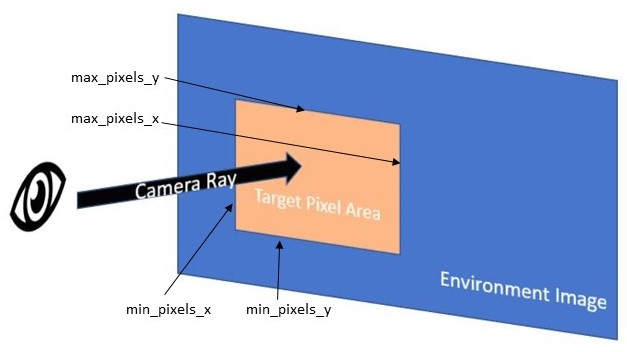

# fall21_headset_demo

## Dev Version Notes:
In the developer's version, certain scenes can be skipped through for ease of testing. In any scene, press the B button to see a visualization of the eye gaze point as a small green sphere. In the DotsVideo scene, skip to the end of the video by long-pressing the X button. In the ImageViewing scenes, long-press the X button to skip the images. 

## Standard Experiment Build Order:

0: Menu1

1: DotsVideo

2: ImageViewing1

3: ImageViewing2

4: ImageViewing3

5: ImageViewing4

6: ImageViewing5

7: ImageViewing6

8: ImageViewing7

9: ImageViewing8

10: ImageViewing9

11: ImageViewing10

12: Menu2

13: TextRectDemo

## Customization

### Random Dot Viewing (DotsVideo): 
Participants are instructed to follow the semi-random moving dot with their eyes for approximately 1.5 minutes. The collected eye-tracking data, along with the data from the image viewing scenes, will be used as reference data for authentication. The file RAN_Sample.mp4 located in Assets>360_photos is a video of a semi-random moving dot used in a previous experiment. Replace this file to test other random dot viewing scenarios.
### Image Viewing: 
Loading all the images in a single scene caused the program to crash as soon as the image viewing scene was entered. Instead, the images were placed into ten blocks of five images each prior to running the simulation. Within each scene, the image order is randomized, leading to a randomly ordered sequence of images. Participants experience short 5 second breaks between each image, and a longer break halfway through the images. 

To use custom images, randomly order a set of 50 360-degree images maintining their original index values (0-49). Next, select the next block of five images from the random ordering. In each ImageViewing scene (ImageViewing1 - ImageViewing10), populate the "Photos" list on the "360 Sphere" gameobject with this block of images by dragging and dropping the image files into the inspector pane. Populate the "Standard_indices" list with the corresponding indices, and repeat with all ten ImageViewing scenes. To achieve minimal distortion, padding was added to images with an aspect ratio greater than 2.1:1, to enforce an ideal aspect ratio of 2:1. In the virtual reality environment, this padding appears below the participant as a black disk. This fix combats distortion with minimal distraction.  
### Nuclear Training Simulation (TextRectDemo):
Areas of interest (AOIs) are transparently outlined to give cues about the equipment to participants. Pointing controllers at the equipment prompts text descriptions and a temporary green outline. Additionally, on-screen text prompts and researcher guidance assist participants in progressing through the simulation. Each step in the simulation corresponds to an AOI. To progress through the simulation, participants perform point and click button presses using the A button on the AOIs corresponding to each step in powering up the nuclear reactor. Progress is visually indicated to participants with a green outline around the equipment they have used.

The nuclear training simulation is performed with a 360 degree image of the University of Florida Training reactor, but can be run with a custom equirectangular image and custom rectangular AOIs. Make the following edits to the RayCast_Demo.cs script:
1. Identify the line initializing the variable ImagePixels in the function Start(). Change the line (Line 132) to “ImagePixels = new Vector2(pixels_x, pixels_y)” where pixels_x and pixels_y correspond to YOUR image’s size in pixels
2. Identify the block of code adding elements to the List targets in the function Start(). Delete all additions to targets (Lines 137-150). Make your own additions in the following format:
targets.Add(new Target(new Vector2(min_pixels_x, min_pixels_y), new Vector2(max_pixels_x, max_pixels_y), "Equipment name", step number (integer), "Equipment prompt")); where min_pixels_x corresponds to the minimum pixel coordinate of x that is included in your AOI, max_pixels_x corresponds to the maximum pixel coordinate of x that is included in your AOI, and so on. Step number represents the order in which participants must view equipment, starting at 1. If equipment is not used in the simulation, but still appears as an AOI, step number is 0.

## Stimulus Licensing
### RAN_Sample:
Citation: Griffith, Henry; Lohr, Dillon; Komogortsev, Oleg V. (2020): GazeBase Data Repository. figshare. Dataset. https://doi.org/10.6084/m9.figshare.12912257.v3 
License: CC 4.0
### ImageViewing:
- Salient360!
  - Citation: Yashas Rai, Jesús Gutiérrez, and Patrick Le Callet, “A Dataset of Head and Eye Movements for 360 Degree Images”, Proceedings of the 8th ACM on Multimedia Systems Conference (MMSys’17), Taipei, Taiwan, pp. 205-210, Jun. 2017.
  - Link: https://salient360.ls2n.fr/datasets/training-dataset/
- European Southern Observatory (ESO) Panoramas
  - Citation: "Credit: ESO"
  - Link: https://www.eso.org/public/usa/images/archive/category/360pano/
  - License: CC 4.0
- Flickr NASA
  - License: Public Domain 
  - Links: NASA panoramas access as public domain https://www.flickr.com/photos/165445115@N07/with/49209540743/
 
### Nuclear Training Simulation: 
Image of the UF training reactor courtesy Andreas Enqvist and the UF Training Reactor (UFTR). Please cite the paper below if this 360 image is used in your own work.

Citation: LaRubbio, K., Wright, J., David-John, B., Enqvist, A., & Jain, E. (2022). Who do you look like? Gaze-based authentication for workers in VR. IEEE Conference on Virtual Reality and 3D User Interfaces Abstracts and Workshops (IEEE VRW) 2022.

License: CC 4.0

